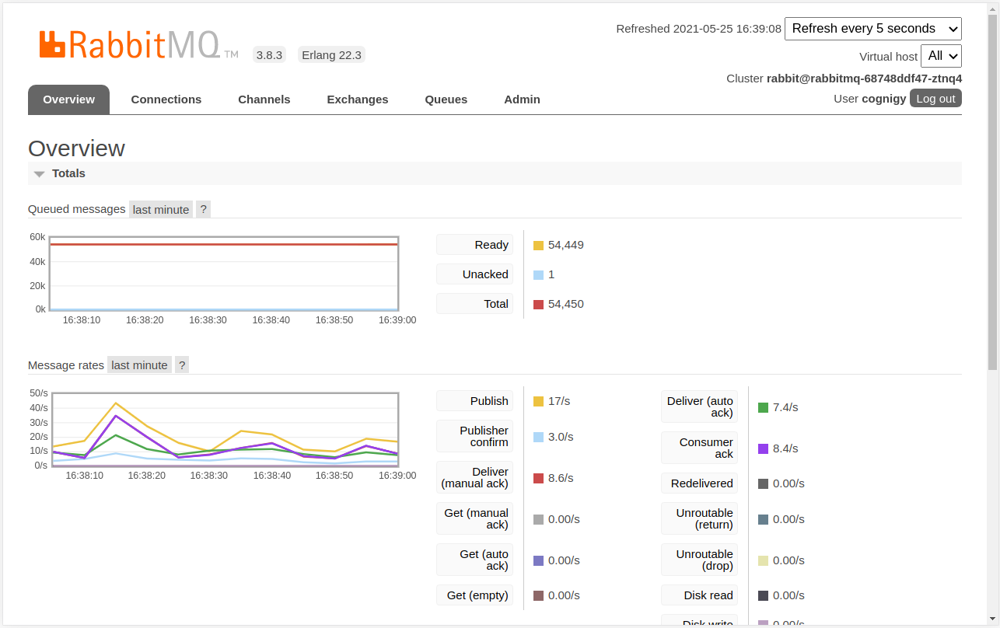
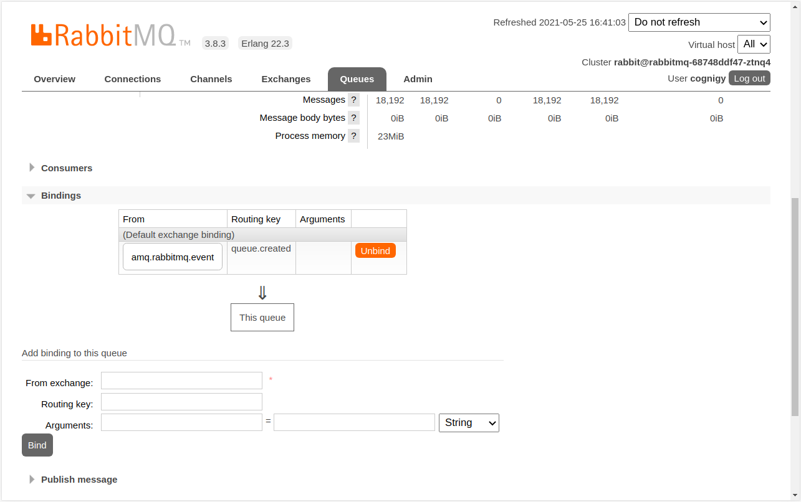
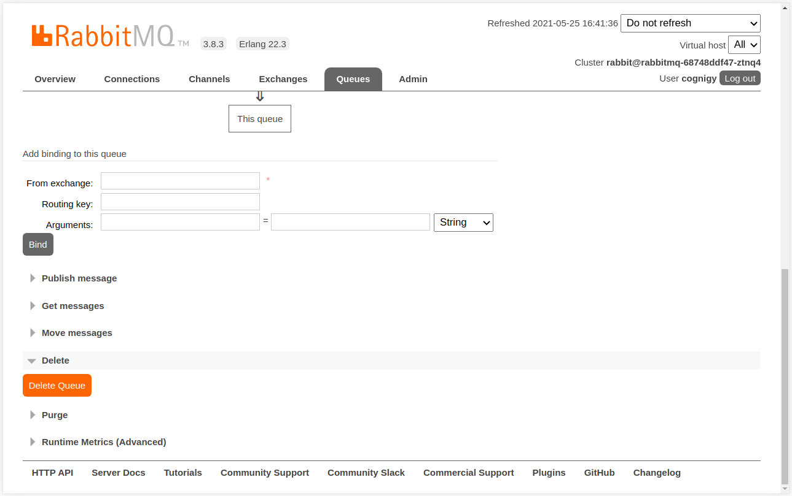

# Cognigy.AI v4.2.X to v4.3.0
This document aims to give you all information necessary to understand what has been changed in our Cognigy.AI product from an ops perspective - as well as describe how you can actually update to this version of Cognigy.AI.

`Please make sure that you are at least on Cognigy.AI v4.2.0 before you start following this guide! We also want to mention that you have to carefully read these instructions before you actually start with the upgrade. Cognigy.AI v4.3.0 requires changes to the storage-system! Please also note that the upgrade to v4.3.0 will disconnect your users as we have changed the core routing pattern how end-user messages will be processed. We suggest to upgrade in low-traffic hours!`

## Removed Microservices
Cognigy.AI v4.3.0 contain performance improvements as we have changed one of our core message-routing patterns. The following two microservices are no longer necessary:
- service-cleanup
- service-conversation-manager

**Once your Cognigy.AI v4.3.0 Pods are up**, you will see that both Deployments wiill have their Pods in the ImagePullBackOff state - no container images exist for these microservices and this release! Please make sure that you don't remove the deployments during the update, but after the update has been completed! You can safely remove those Deployments using the following two commands:
```
kubectl delete deployment service-cleanup
kubectl delete deployment service-conversation-manager
```

As we also no longer want to apply these deployments or gen any errors during running our `kubectl apply -k ./` commands during upgrading, please make sure that you adjust your `kustomization.yaml` file located in the `product` folder. Remove the following lines from it:
```
- manifests/deployments/service-cleanup.yaml
- manifests/deployments/service-conversation-manager.yaml
```

## New Microservices
Cognigy.AI v4.3.0 comes with a new feature called "Cognigy Functions". You can read more about this feature in our product documentation on https://docs.cognigy.com. The following files - related to functions - have been added to this repository:
- **1 Persistent Volume**
  - **location**: `core/manifests/volumes/functions.yaml`
  - **functionality**: Stores the contents of Cognigy Functions, so essentially the code of your functions.
- **1 Persistent Volume Claim**
  - **location**: `core/manifests/volume-claims/functions.yaml`
  - **functionality**: Expresses the need for storage and is directly referenced in deployments.
- **2 Deployments**
  - **location**: `core/manifests/deployments/service-function-scheduler.yaml | service-function-execution.yaml`
  - **functionality**: Manages Cognigy Functions and their instances | executes the code of Cognigy Functions.
- **1 Secret**
  - **location** `core/template.dist/product/secrets.dist/cognigy-service-function-scheduler.yaml`
  - **functionality**: Stores the connection-string for the function-scheduler database.

We have also changed the `service-resources` Deployment as it now also references the new PersistentVolumeClaim for functions. Let's have a look at the individual steps you need to go through in order to implement those changes accordingly.

### Database
Cognigy.AI will store information about running Functions in a new database which is managed by `service-function-scheduler`. This database does not exist within your database-server, so let's create it.

Let's first create a random token which we can use as a database password. You can either generate this password using a password-manager or use the following openssl command to create some random noise:
```
openssl rand -hex 64
```

This will generate a 128 character long alpha-numerical string which we can use as a database password. You now have to connect to the `MongoDB` database server in order to create the new database as well as a user with read/write permissions for it. If you are using a fully managed `MongoDB Atlas` deployment, login into your management panel in order to do that. If you are running MongoDB as containerized workloads on top of Kubernetes, do the following:

Open an interactive shell to the MongoDB (primary):
```
kubectl exec -it deployment/mongo-server -- sh
```

Connect to the actual database server using the mongodb-client (present in the Pod):
```
mongo -u admin -p $MONGO_INITDB_ROOT_PASSWORD --authenticationDatabase admin
```

Create new database and create new user (be sure to replace `<your password>` with yours!):
```
use service-function-scheduler
db.createUser({
	user: "service-function-scheduler",
	pwd: "<your password>",
	roles: [
		{ role: "readWrite", db: "service-function-scheduler" }
	]
});
```

Exit from the mongo-shell as well as the Pod:
```
exit

exit
```

### Secret
We have created the new database (including a user) in the previous step. We now have to make sure that we also deploy an additiona `kubernetes secret` into our cluster, so that new Pods can actually consume a connection-string in order to connect to the new database.

We have added a new `blueprint secret` into the `core/template.dist/product/secrets.dist/` path of this repository. The name of the file is `cognigy-service-function-scheduler.yaml`. Please copy this file and put it into your `product/secrets` folder. Then open your copy in a text-editor - it should look like the following:
```yaml
apiVersion: v1
kind: Secret
metadata:
  name: cognigy-service-function-scheduler
type: Opaque
data:
  # The full mongodb connection string, has a schema of:
  # mongodb://service-xx:<password>@<host>:<port>/xx or different for replica-set
  connection-string:
```

Depending on your MongoDB replica-set configuration, the following might slightly be adjusted for your setup. A connection string usually looks like the following:
```
mongodb://<db-user-name>:<password>@<host/ip>:<port>/<database-name>
```

So let's build our connection-string (be sure to replace `<password>` with your own):
```
mongodb://service-function-scheduler:<password>@mongo-server:27017/service-function-scheduler
```

You now have to base64 encode this string, be really sure that you have replace `<password>` with your actual password!:
```
echo -n "<connection-string>" | base64 -w0
```

You can now place this into your file. It should look similar like the following (I have omitted a couple of characters):
```yaml
apiVersion: v1
kind: Secret
metadata:
    name: cognigy-service-function-scheduler
type: Opaque
data:
    # The full mongodb connection string, has a schema of:
    # mongodb://service-function-scheduler:<password>@<host>:<port>/database or different for replica-set
    connection-string: bW9uZ29kYjovL3Nl...aGVkdWxlcg==
```

You can now save this file and apply it into your cluster:
```
kubectl apply -f cognigy-service-function-scheduler.yaml
```

### Storage
Cognigy.AI v4.3.0 needs an additional volume in which functions can be stored. This storage volume needs to be accessible by multiple Pods, hence a `RWX`-style volume is necessary. We have created a new Persistent Volume as well as Persistent Volume Claim.

Depending on the storage type you are using for your installation (e.g. local node storage, EFS on Amazon Web Services), you will have to adjust your storage configuration appropriately.

Please have a closer look at the two new files:
- `core/manifests/volumes/functions.yaml`
- `core/manifests/volume-claims/functions.yaml`

If you are using a `single node Kubernetes cluster`, you would probably load those two files in addition into the `kustomization.yaml` in the `dependencies` folder. The following is just an example:

**Before**:
```yaml
# ----------------------------------------------------
# apiVersion and kind of Kustomization
apiVersion: kustomize.config.k8s.io/v1beta1
kind: Kustomization

# Adds namespace to all resources.
namespace: default

resources:
# storage: persistent volumes
- manifests/volumes/flow-modules.yaml
- manifests/volumes/mongodb.yaml
- manifests/volumes/redis-persistent.yaml

# storage: persistent volume claims
- manifests/volume-claims/flow-modules.yaml
- manifests/volume-claims/mongodb.yaml
- manifests/volume-claims/redis-persistent.yaml

# configmaps
- manifests/config-maps/redis.yaml
- manifests/config-maps/redis-persistent.yaml
...
```

**After**:
```yaml
# ----------------------------------------------------
# apiVersion and kind of Kustomization
apiVersion: kustomize.config.k8s.io/v1beta1
kind: Kustomization

# Adds namespace to all resources.
namespace: default

resources:
# storage: persistent volumes
- manifests/volumes/functions.yaml // <- this line is new
- manifests/volumes/flow-modules.yaml
- manifests/volumes/mongodb.yaml
- manifests/volumes/redis-persistent.yaml

# storage: persistent volume claims
- manifests/volume-claims/functions.yaml // <- this line is new
- manifests/volume-claims/flow-modules.yaml
- manifests/volume-claims/mongodb.yaml
- manifests/volume-claims/redis-persistent.yaml

# configmaps
- manifests/config-maps/redis.yaml
- manifests/config-maps/redis-persistent.yaml
...
```

So we load the additional `Persistent Volume` in the '# storage: persistent volumes' section of the file and one additonal `Persistent Volume Claim` in the '# storage: persistent volume claims' section. If using a `single node Kubernetes cluster`, you would also have to add an additional `functions_patch.yaml` file in the `core/<environment>/overlays/volumes` folder with a content similar to the following:
```yaml
- op: replace
  path: /spec/local/path
  value: "/var/opt/cognigy/functions"
- op: replace
  path: /spec/nodeAffinity/required/nodeSelectorTerms/0/matchExpressions/0/values
  value:
    - "<hostname>"
```

Be sure to replace "<hostname>" appropriately. You will also have to load this patch into the `kustomization.yaml` in your dependencies folder:
```yaml
...
- target:
    version: v1
    kind: PersistentVolume
    name: functions
  path: overlays/volumes/functions_patch.yaml
```

Finally you have to create the path in the file-system and set the correct permissions:
```
sudo mkdir -p /var/opt/cognigy/functions
sudo chown -R 1000:1000 /var/opt/cognigy/functions
```

If you are using a Kubernetes cluster on AWS, GCP or Azure, we suggest that you have a look into the `cloudproviders` folder.

### Kustomization
In order to preserve any changes we apply to Cognigy's original manifest files, we use `kustomize`. Please carefully read the **Storage** section above as it already describes the changes that you have to implement regarding storage as we are also using a separate kustomization file for storage components.

In order to reflect all changes regarding our actual product Cognigy.AI, please open your `kustomization.yaml` file located in the `product` sub-folder.

Please first remove the following two lines from it:
```yaml
- manifests/deployments/service-cleanup.yaml
- manifests/deployments/service-conversation-manager.yaml
```

These two new deployments no longer exist in our `manifests` folder and will lead to errors when you try to run the kustomization! Simply just remove those two lines. At the same time, add the following new lines right below `service-execution`:
```yaml
- manifests/deployments/service-function-scheduler.yaml
- manifests/deployments/service-function-execution.yaml
```

The '#deployments' section of your file should look like this:
```yaml
...
# deployments
- manifests/deployments/service-ai.yaml
- manifests/deployments/service-alexa-management.yaml
- manifests/deployments/service-analytics-collector.yaml
- manifests/deployments/service-analytics-conversations.yaml
- manifests/deployments/service-analytics-odata.yaml
- manifests/deployments/service-analytics-realtime.yaml
- manifests/deployments/service-analytics-reporter.yaml
- manifests/deployments/service-api.yaml
- manifests/deployments/service-custom-modules.yaml
- manifests/deployments/service-endpoint.yaml
- manifests/deployments/service-execution.yaml
- manifests/deployments/service-function-scheduler.yaml
- manifests/deployments/service-function-execution.yaml
- manifests/deployments/service-handover.yaml
- manifests/deployments/service-http.yaml
- manifests/deployments/service-journeys.yaml
- manifests/deployments/service-logs.yaml
- manifests/deployments/service-nlp-ner.yaml
- manifests/deployments/service-parser.yaml
- manifests/deployments/service-profiles.yaml
- manifests/deployments/service-resources.yaml
- manifests/deployments/service-security.yaml
- manifests/deployments/service-task-manager.yaml
- manifests/deployments/service-trainer.yaml
- manifests/deployments/service-ui.yaml
- manifests/deployments/service-webchat.yaml

...
```

Cognigy.AI v4.3.0 also changes the `service-resources` deployment and adds a new `volumeMount` as well as a new `volume`. We have updated this deployment manifests - so you don't have to change anything. In case you are interested, we have added the following volumeMount:
```yaml
- name: functions
  mountPath: /app/functions
```

and the following volume:
```yaml
- name: functions
  persistentVolumeClaim:
    claimName: functions
```

Once you have created the additional PV and PVC, you can then also run the kustomization in the product folder in order to actually perform the update to Cognigy.AI v4.3.0.

## Cleanup
Once you are done with upgrading your Cognigy.AI installation to v4.3.0, the last **cleanup step** can be performed. We have replaced a core routing-pattern of end-user messages with this release and there are still two leftover queues within RabbitMQ that we have to remove:
- consumer-events
- queue-events

**Important: If you forget to remove these two queues, the system will become unresponsive at some point and will crash!**

In order to unbind and delete those queues, you have to login into the RabbitMQ management-panel - a web-interface in order to manage your RabbitMQ installation. Please follow these steps in order to get rid of the queues above:

1) Open a secure tunnel to RabbitMQ:
```
kubectl port-forward deployment/rabbitmq 15672
```

2) Get the password for RabbitMQ:
```
kubectl get secret cognigy-rabbitmq -o jsonpath='{.data.rabbitmq-password}' | base64 -d
```

3) Login into the RabbitMQ management panel:
Visit http://localhost:15672 on your web-browser, login with "cognigy" and use the output from the last command as the password. You should see something like this:



4) Click on "Queues", add "events" into the "Filter:" box and hit ENTER. You will see that two of the queues in the resulting list have some messages in them. These should be named "queue-events" and "consumer-events".

5) Click on "queue-events", then scroll down and click on "Bindings". Click on "Unbind" to prevent that new messages can be added to this queue. Scroll further down and click on "Delete" followed by "Delete Queue" - accept the popup with "Ok".




6) Repeat the same steps for "consumer-events".