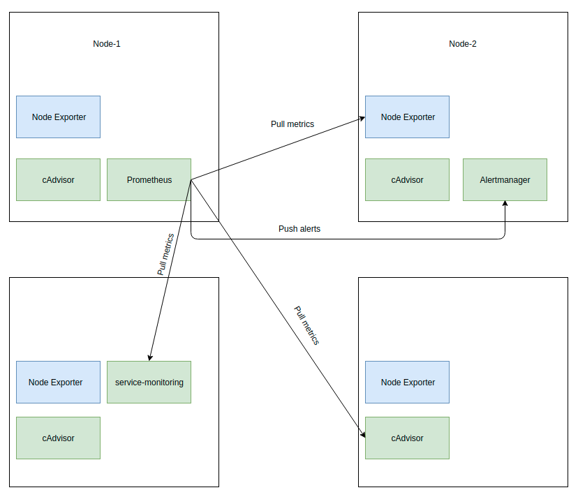

# Monitoring your COGNIGY.AI installation
In order to understand whether your COGNIGY.AI installation is working properly and performant, we added full support for Prometheus, a monitoring solution for containerized software products.

## Introduction
### Overview
COGNIGY.AI is a de-centralized and fully containerized software product. The whole software consists of multiple so-called services that work together and are loosely coupled over the network. A central message broker - we are using **RabbitMQ** - connects all services together and allows individual services to communicate with each other.

Individual service specialize in certain functionality and fullfil simple tasks, e.g. modifying state within a database. Most of our services produce metrics which can be used for further analysis and a detailed understanding of how the whole platform works. These metrics are collected by an additional service called:
**service-monitoring**

Metrics collected by our monitoring service can be retrieved from a running Prometheus installation. Prometheus scrapes (polling) the metrics on a regular basis and stores them within a highly performant time-series data-stream. It can also run queries against the stored metrics and e.g. extract meaningful meta-data.

Grafana, an additional product, can then be used to execute those queries against Prometheus, retrieve the metrics and render them on easy to understand dashboards.

The following schematics shows the data-flow between services:



Alertmanager can then also run queries against Prometheus and send alerts if certain conditions evaluate.

### Directory structure
This directory has the following folder-structure:
```
| - config-maps
| - deployments
| - secrets.dist
| - services
| - volume-claims
| - volumes.dist
```

## Setup
This section will guide you through the process of setting up your monitoring stack for an existing COGNIGY.AI installation.

### Config map
---
In order to configure your monitoring pipeline, so-called config-maps are used. These store configuration data for individual software products like Prometheus, Alertmanager and Grafana.

Adjust the files within the ``config-maps`` directory so they work for your use-case.

After you are done with your modifications, deploy those within your K8s cluster:
```
kubectl apply -f monitoring/config-maps
```

### Image Pull Secret
---
In order to pull ``docker images`` from our production registry, you need to define a so-called ``image pull secret``. Kubernetes will use it to authenticate against Cognigy's production registry.

Please have a look at our README file within the root of this repository for further details.

### Secrets
---
We are using secrets for our monitoring stack as well. Secrets are a secure way to make sensitive data available for a running container.

We have two secrets within the monitoring stack. Please create a copy of the ``monitoring/secrets.dist`` folder, name it ``secrets`` and apply the necessary changes to the ``monitoring/secrets`` files.

You can find more information on how to apply the changes to the secret blueprint-files in the main README within the root of this repository.

After your modifications, apply your changes to the cluster:

```
kubectl apply -f monitoring/secrets
```

### Storage
#### Introduction
---
Our main product already stores certain data which is made accessible using ``NFS``.

For the monitoring stack we need additional folders being shared through NFS.

We usually store the files for **grafana** and **prometheus** within the following folders:
```
sudo mkdir -p /var/opt/cognigy/grafana
sudo mkdir /var/opt/cognigy/prometheus
```

#### Persistent Volumes
---
Persistent Volumes (PV) are used to make the NFS shares accessible within your K8s cluster. Check the contents of ``monitoring/volumes.dist``, create a copy of the folder, name it ``volumes`` and open them within a text editor.

You will need to change the ``path`` and the ``server`` within the ``nfs`` section. After you applied your changes, apply the files to your cluster:
```
kubectl apply -f monitoring/volumes
```

#### Persistent Volume Claims
---
Persistent Volume Claims (PVC) connect your PVs with the actual Pods being scheduled in your K8s cluster. You can simply apply those files to your cluster:
```
kubectl apply -f monitoring/volume-claims
```

### Deployments & Services
After all PVs, PVCs, Secrets and Config-Maps were applied to the cluster, we can finally apply the last objects to our cluster:
```
kubectl apply -f monitoring/services
kubectl apply -f monitoring/deployments
```